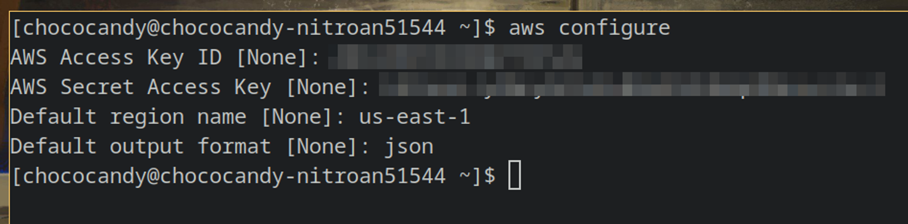
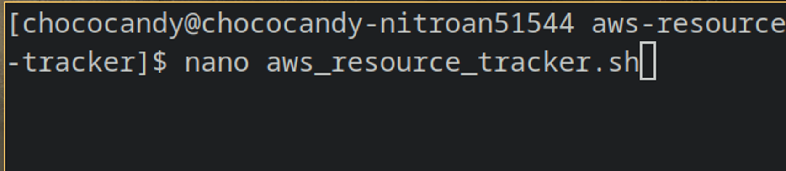
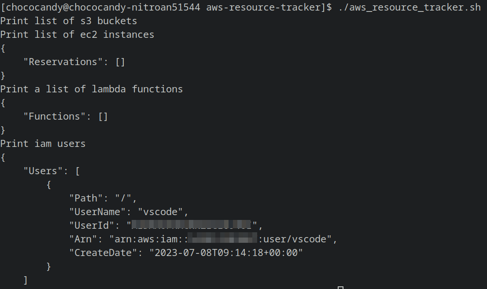
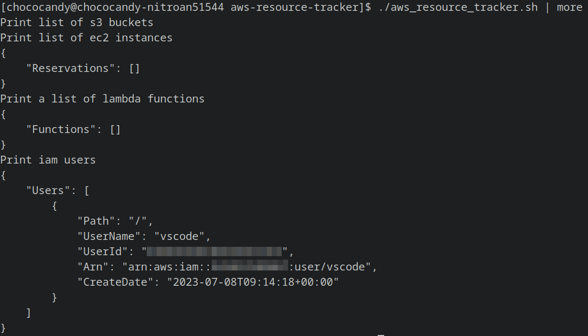
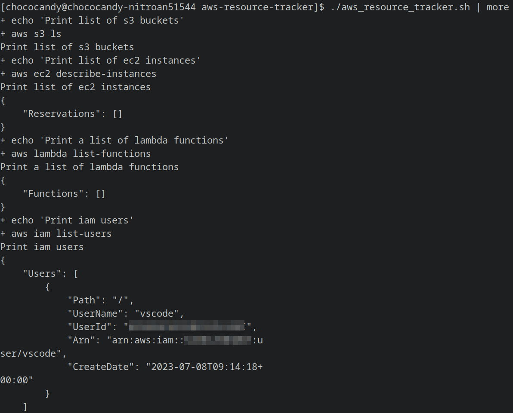
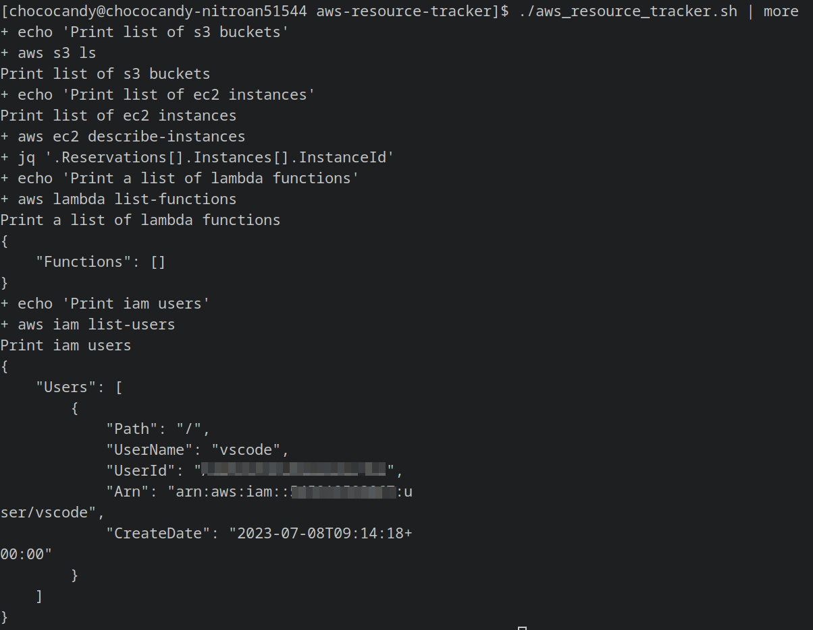
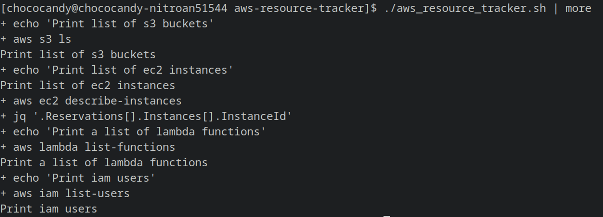

# AWS-Resource-Monitor Project
AWS Project using SHELL SCRIPTING- DevOps project

### Purpose of the project
To create a shell script that will monitor the aws resource usage at a particular instance of time.

### Prerequisites 

- Linux machine( or AWS EC2 ubuntu instance)
- AWS CLI
- Bash
- AWS configure (Provide the access key, secret access key, default output region, JSON format) do the following configurations.

### Concept Of Cron Job

How to make sure that a certain script is running at X or Y time? → Using cron jobs in Linux

For example: If by chance you don't get a chance to execute the shell script at a particular instance of time or if you missed it by mistake then cronjob will automatically execute the shell script for you.

You can set a cronjob - Your Linux machine will wait for that particular instance of time and automatically will execute the shell script for you.

### TASK 

Write a SHELL SCRIPT to monitor aws resource usage and integrate it with a CRON JOB

###  Setting Up Environment

Step 1: Check whether `aws-cli` is installed or not.

Step 2: Configure your credentials to talk to aws using aws configure.
For reference:[https://docs.aws.amazon.com/cli/latest/userguide/cli-chap-configure.html](https://docs.aws.amazon.com/cli/latest/userguide/cli-chap-configure.html)

Step 3: Create a new folder `aws_resource_tracker` and cd into it. Open a new file `nano aws_resource_tracker.sh`.

Step 4: Write the shell script. 
Always refer in case of any doubts:[https://docs.aws.amazon.com/cli/latest/reference/](https://docs.aws.amazon.com/cli/latest/reference/)

Step 5: Give permissions by running `chmod 777 aws_resource_tracker.sh`. Using chmod 777
means to make the file readable, writable, and executable by everyone with access.
Run the script `./aws_resource_tracker.sh` 

Step 6: Use this command for a better file mode view `./aws_resource_tracker.sh | more`

Step 7: Set the script in Debug Mode by adding `set -x` to the script.

We can simplify the output- if we only need to see aws instance id then we can use `jq`- JSON parser to extract the required information from JSON file.

Step 8: Replace `aws ec2 describe-instances` with  `aws ec2 describe-instances | jq '.Reservations[].Instances[].InstanceId'` to get more simplified output.

Explanation: We use a pipe to send the output of the first command to `jq`, `jq` is a JSON parser to get info from JSON files. Similarly, `yq` is used as yml parser.

Step 9: Redirect command output to a file by replacing `aws s3 ls` with  `aws s3 ls >> resourcetracker`. Similarly, follow the same for all commands.
New file: resourceTracker has been created.

Step 10: Integrate the shell script into a Cron Tab. Scheduling future jobs using crontab.
Installing crontab on Arch-linux: `sudo pacman -S cronie`.

`crontab -e`: To edit the crontab to schedule your tasks.

Crontab is a file that has actions of the cron, it is a configuration that specifies shell commands to run periodically on a given schedule. Run a particular script at a particular time, it does not require any manual intervention.  

Suppose, I want a script to run at 37 min 5 hours on every day of the month, every month, and every year so I will add the following command to crontab:
`37 05 * * * /bin/bash /chococandy/aws-resource-tracker/aws_resource_tracker.sh`

37     05    *      *      * 
min | hour | day | month | week 

Further, we can modify it to */1 which means it runs every minute.

List to current active jobs to this crontab:

Links for more details: 
- [ec2-describe-instances-command](https://docs.aws.amazon.com/cli/latest/reference/ec2/describe-instances.html)
- [s3-ls-command](https://docs.aws.amazon.com/cli/latest/reference/s3/ls.html)
- [lambda-list-functions-command](https://docs.aws.amazon.com/cli/latest/reference/lambda/list-functions.html)
- [iam-list-users-command](https://docs.aws.amazon.com/cli/latest/reference/iam/list-users.html)

